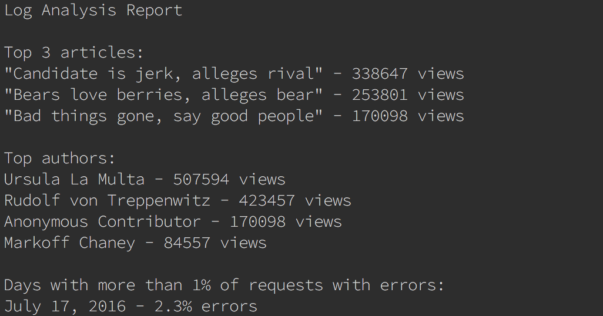

# Logs Analysis
Report generator for Udacity FSWD Log Analyze Project

## Requirements

- python 3
- psycopg2-binary >= 2.7.4
- [The news Database from Udacity](https://d17h27t6h515a5.cloudfront.net/topher/2016/August/57b5f748_newsdata/newsdata.zip)

## Usage

    $ python3 report.py

## Output
The program will output a report for the following questions:

- Top Articles, the 3 most viewed articles
- Top Author, the most popular authors
- Requests with errors, The days with more than 1% of error on page requests.

## Example

You can also find an example of output in [sample_output.txt](sample_output.txt)

## Extra Information

This project was tested with:

- python 3.* on MacOSX

## License
You can't use this project as your project for Udacity, but you can use for study purposes if you want.

